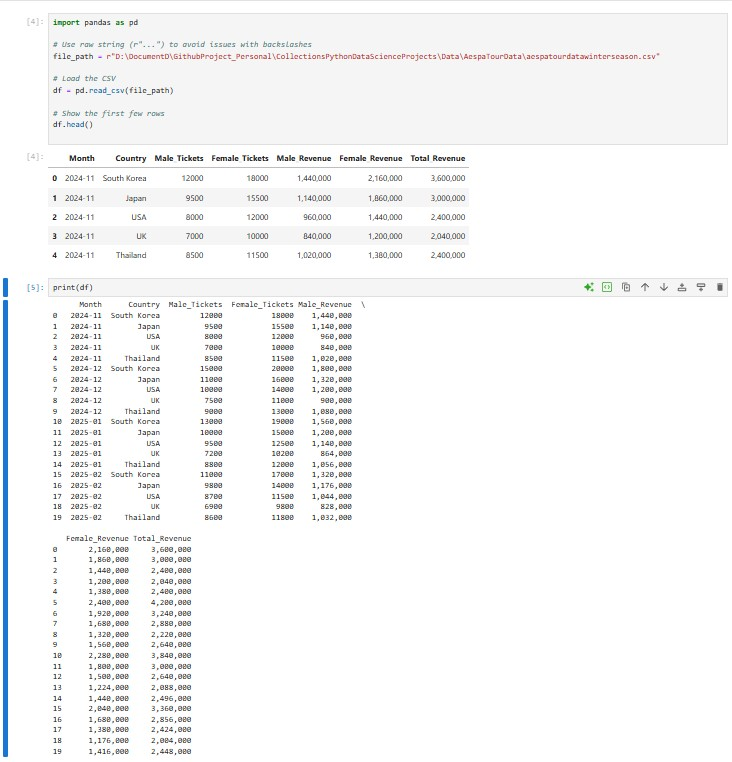
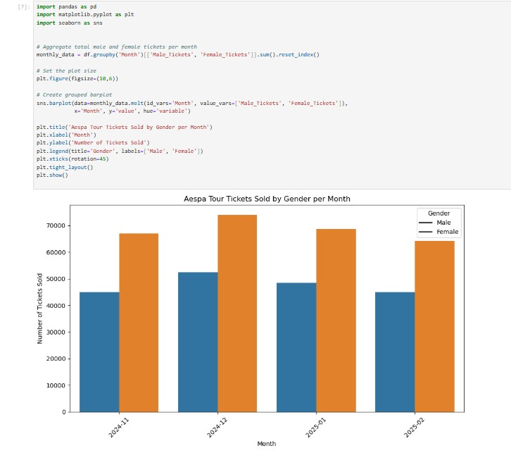
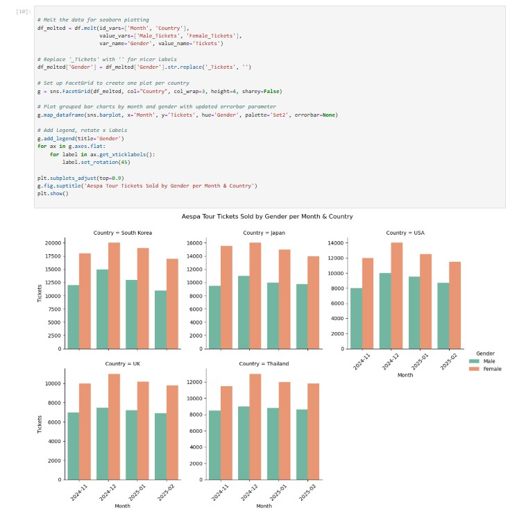

# A collection of Waiyat Data Science Projects to learn Python mathplotlib , numpy ,opencv , skitlearn etc 

## Table Content
- [Data Exploration](#data-exploration)

## Data Exploration
-[WaiyatSamsungWatchActivity](ipynb/WaiyatSamsungWatchActivity.ipynb)

-[Lovely Runner Actors Popularity](ipynb/LovelyRunnerActorsPopularity.ipynb)

-[AespaWinterTourSeasonData ](ipynb/AespaTourWinterSeason.ipynb)

